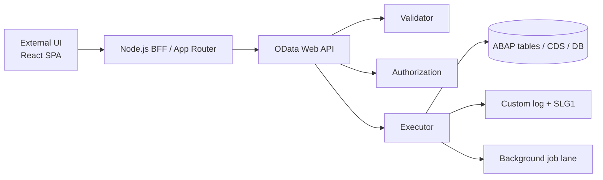
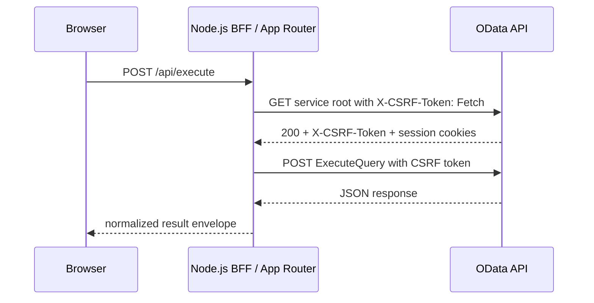
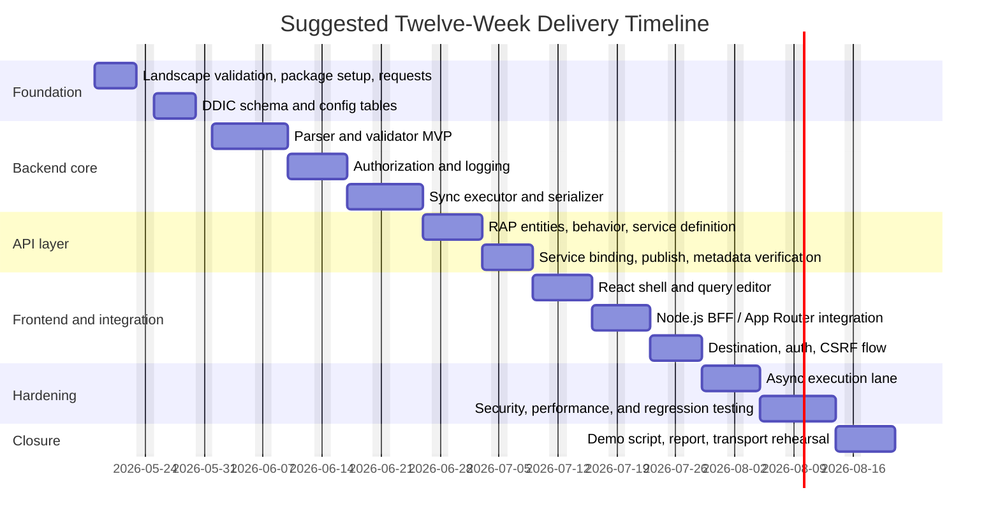

# Interactive ABAP SQL Workbench Tool Project Plan

## Executive Summary

This project should be built as a controlled query service, not as a raw “run any SQL” console. The recommended baseline is a RAP-based OData V4 Web API for new development, because current ABAP tooling exposes RAP business services through service bindings, Web API bindings are intended for unknown consumers and data-only content, and ADT supports metadata verification and OData integration testing around service bindings. Keep a classic Gateway OData V2 fallback only for older landscapes where RAP or OData V4 Web API bindings are not available. This plan follows current guidance from entity["company","SAP","enterprise software"] on RAP, service bindings, CTS, testing, and connectivity. citeturn21search5turn23search3turn20search1turn21search9turn21search17turn8search0turn17search0turn22search13

The central architectural decision is to return a stable execution envelope from OData instead of trying to model arbitrary query result columns directly in static OData metadata. OData services are contract-driven and typed; an ad hoc SQL workbench is not. The clean solution is to expose an action such as `ExecuteQuery` that returns fixed fields like `runId`, `status`, `rowCount`, `columnsJson`, `rowsJson`, `durationMs`, and `errorMessage`. For RAP action request and response types, use DDIC structures or CDS abstract entities; do not base the action result on a custom entity. Actions are the right semantic choice because every execution writes audit data and therefore has side effects. citeturn14search1turn14search0turn14search5turn2search18turn21search23turn21search25

Security must be first-class from day one. The validator must allow only read-only statements, reject comment-based and multi-statement input, whitelist source objects and columns, enforce row and time limits, and avoid concatenating unsafe external fragments into dynamic SQL. Authorization must combine a custom business authorization model with optional standard table-read checks where relevant, and every execution must be logged to both a custom audit table and the Application Log; in sensitive environments, Read Access Logging is a sensible additional layer for OData channels. CSRF protection must be handled for modifying OData calls, which SAP Gateway enables by default. citeturn0search9turn6search1turn7search2turn7search7turn0search1turn15search2turn15search4turn16search0turn16search16turn16search2turn4search14

A small team can complete a solid student-grade implementation in about twelve weeks if scope is controlled: read-only SQL subset, saved queries, query logs, synchronous execution for short queries, background execution for long queries, a React external UI, and a BTP-based integration path with a BFF or App Router in front of the OData service. That scope is realistic, demonstrable, and aligned with ABAP best practices. citeturn5search0turn5search5turn19search2turn18search3turn18search2

## Assumptions and Decision Record

The following assumptions are used because the brief specifies that unspecified items have no specific constraint.

| Topic | Working assumption for this plan |
|---|---|
| ABAP release | Assume a release new enough to support RAP, service definition, and service binding. If not, use the classic Gateway fallback described later. |
| Landscape | At minimum a DEV system exists. If QAS and PRD exist, standard CTS promotion is used. |
| Database | No hard constraint. Design the validator around a conservative ABAP-friendly SQL subset. If the system is HANA-only, the design can be extended later. |
| Max rows | No hard business limit was given. Recommended default = 500 rows, hard cap = 5,000 rows, role-configurable. |
| Timeout | No hard SLA was given. Recommended synchronous timeout budget = 20 seconds, then route to background execution. |
| External UI | Recommended default = React with a Node.js BFF or App Router. UI5 remains a viable alternate. |
| Identity | Enterprise-ready target = user propagation or token-exchange-based SSO. Student PoC fallback = technical user over HTTPS. |
| Result persistence | Keep a durable log of executions. Persist full result payloads only when async retrieval or audit replay is required. |

The decision record below is grounded in the RAP service-binding documentation, the Gateway Service Builder runtime model, the OData operation model, and the background-processing/runtime-limit documentation. citeturn23search3turn21search5turn17search0turn22search13turn21search23turn8search0turn5search0turn5search5

| Decision area | Option A | Option B | Recommendation |
|---|---|---|---|
| Service framework | RAP with service definition and service binding | Classic Gateway with SEGW, MPC_EXT, DPC_EXT | **Choose RAP first**. Use classic Gateway only if the landscape is too old for RAP/OData V4 Web API or if course constraints require SEGW. |
| OData protocol | OData V4 Web API | OData V2 Web API | **Choose OData V4 Web API** for a new external UI. Use V2 only when the system release or consumer tooling forces it. |
| Execution contract | Static typed entities only | Stable action envelope with JSON payload for dynamic rows | **Choose the stable action envelope** because result columns vary by query. |
| Runtime lane | Synchronous only | Sync + async background mode | **Choose both**. Sync for short queries, async for long-running or high-row-count queries. |
| Frontend topology | Browser calls OData directly | Browser calls Node.js BFF / App Router, which calls OData | **Choose BFF / App Router** for better credential isolation, CSRF handling, and future SSO options. |
| Auth model | Technical service user only | User-aware flow with role mapping and propagation where possible | **Choose user-aware auth** as the target architecture; use technical user only for PoC or constrained landscapes. |

A compact architecture view is shown below.



This report is primarily grounded in the following official references: urlABAP RESTful Application Programming Modelturn0search0, urlABAP CDS service bindingsturn23search3, urlAUTHORITY-CHECK keyword documentationturn0search1, urlDynamic SQL injection safeguardsturn0search9, urlCTS transport guideturn1search11, urlBTP connectivity guideturn19search2, urlABAP Unit guideturn9search0, and urlOData V4 operations guideturn21search25.

## Repository, Transport, and Delivery Topology

ABAP packages group repository objects into self-contained development units, and any repository object created in a non-temporary package must be assigned to a transport request. In ADT, transport requests and tasks are managed through the Transport Organizer, and SAP’s transport process releases developer tasks first and then the parent workbench request. Creating or changing development packages also requires developer authorization on `S_DEVELOP`, and configuring a transport layer requires CTS-related authorization. citeturn1search27turn1search17turn1search3turn1search11turn1search24turn15search1

### Recommended package layout

| Package | Purpose | Owner |
|---|---|---|
| `ZSU26_MILO_SQLWB_PRODUCT` | Main package, anchor for all project objects | Technical lead |
| `ZMILO_SQLWB_DDIC` | Tables, data elements, domains, search helps | ABAP backend |
| `ZMILO_SQLWB_CORE` | Validator, parser, auth, executor, serializer, logger, utilities | ABAP backend |
| `ZMILO_SQLWB_API` | CDS entities, behavior definitions, service definition, service binding | ABAP backend |
| `ZMILO_SQLWB_CONF` | Config tables, SLG0 object setup, customizing-like helpers | ABAP backend |
| `ZMILO_SQLWB_TEST` | ABAP Unit classes, OData integration tests, test doubles | QA/backend |
| `ZMILO_SQLWB_DOC` | Technical documentation, markdown, diagrams, handover artifacts | Whole team |

### Recommended request strategy

| Request type | Naming convention | When to create | Why |
|---|---|---|---|
| Workbench request | `MILO_<sprint>_<workstream>` | Once per sprint or major workstream | Keeps object sets coherent for review and rollback |
| Developer task | Auto-created under the workbench request | Per developer | Standard CTS ownership model |
| Urgent fix request | `MILO_HOTFIX_<topic>` | Only for isolated urgent repair | Avoids mixing urgent fixes with feature transports |

### Step-by-step transport workflow

1. Create the main package `ZMILO` with a real transport layer, not `$TMP`.
2. Create the subpackages listed above.
3. Create one workbench request for the sprint or workstream.
4. Let each developer work in their own task beneath that request.
5. Activate objects frequently and run ABAP Unit plus ATC before release.
6. Release each developer task.
7. Release the parent workbench request.
8. Import into QA.
9. Verify service metadata, smoke-test endpoints, and execute regression tests.
10. Import into production or the final demo system only after QA sign-off. citeturn1search11turn1search25turn1search24turn9search0turn9search1turn21search9

### Initial setup checklist

| Step | Action | Notes |
|---|---|---|
| ADT enablement | Verify ADT ICF service activation and developer access | Basis/admin task |
| Development authorization | Confirm `S_DEVELOP` and package/transport authorizations | Required before object creation |
| Package bootstrap | Create `ZMILO` and subpackages | Use transportable packages |
| Logging object | Create SLG0 object `ZMILO` with subobjects `EXEC`, `AUTH`, `API` | Supports SLG1 diagnostics |
| Request naming policy | Agree a request naming standard before coding starts | Prevents chaotic transport history |
| Branching policy | Mirror package boundaries in Git docs or frontend repo structure | Helps cross-team coordination |

The ADT backend must expose the ADT ICF service for Eclipse-based ABAP development, and the package and transport authorization prerequisites described above should be validated before the project starts. citeturn10search7turn15search1

## Backend Domain Model and ABAP Objects

The repository blueprint below favors RAP for stable business artifacts and a dedicated execution layer for the inherently dynamic SQL result. RAP service bindings support Web APIs, and CDS abstract entities are suitable as stable request/response types because they define global structured types without creating database objects. If, later, the project needs a separately queryable virtual result set, a custom entity can be added and implemented with `IF_RAP_QUERY_PROVIDER`, but that is an enhancement path rather than the MVP. citeturn23search3turn14search5turn2search4turn14search21

### Required object inventory

| Area | Recommended object | Type | Purpose |
|---|---|---|---|
| DDIC | `ZMILO_LOG` | Transparent table | Execution audit log |
| DDIC | `ZMILO_QUERY` | Transparent table | Saved queries |
| DDIC | `ZMILO_ROLE` | Transparent table | Role-to-capability mapping |
| DDIC | `ZMILO_WLIST` | Transparent table | Whitelisted tables/views/CDS entities |
| DDIC | `ZMILO_MASK` | Transparent table | Sensitive-field masking rules |
| DDIC | `ZMILO_RES` | Optional transparent table | Persisted async results or retained payloads |
| OO | `ZIF_MILO_EXECUTOR` | Interface | Executor contract |
| OO | `ZCL_MILO_PARSER` | Class | SQL subset parser/tokenizer |
| OO | `ZCL_MILO_VALIDATOR` | Class | Static and semantic validation |
| OO | `ZCL_MILO_AUTH` | Class | Capability and standard auth checks |
| OO | `ZCL_MILO_EXECUTOR` | Class | Sync execution lane |
| OO | `ZCL_MILO_BGJOB` | Class | Async job submission and polling |
| OO | `ZCL_MILO_SERIALIZER` | Class | Column metadata and row JSON serialization |
| OO | `ZCL_MILO_LOGGER` | Class | `ZMILO_LOG` + Application Log writes |
| OO | `ZCL_MILO_CONFIG` | Class | Reads role, whitelist, and masking config |
| OO | `ZCX_MILO_VALIDATION` | Exception class | Validation failures |
| OO | `ZCX_MILO_AUTH` | Exception class | Authorization failures |
| OO | `ZCX_MILO_EXECUTION` | Exception class | Runtime and DB failures |
| CDS | `ZI_MILO_QUERY` | Interface view entity | Saved query interface |
| CDS | `ZC_MILO_QUERY` | Projection view | Saved query API projection |
| CDS | `ZI_MILO_LOG` | Interface view entity | Execution log interface |
| CDS | `ZC_MILO_LOG` | Projection view | Execution log API projection |
| CDS | `ZAE_MILO_EXEC_IN` | Abstract entity | Execute action request type |
| CDS | `ZAE_MILO_EXEC_OUT` | Abstract entity | Execute action response type |
| RAP | Behavior for `ZI_MILO_QUERY` | Behavior definition + implementation | CRUD for saved queries, plus run action if desired |
| RAP | Behavior for `ZI_MILO_LOG` | Read-only behavior | Read-only log access |
| Service | `ZAPI_MILO` | Service definition | Public API scope |
| Service | `ZAPI_MILO_O4` | Service binding | OData V4 Web API binding |
| Fallback | `ZGW_MILO` | SEGW project | Classic Gateway fallback |
| Fallback | `ZCL_ZGW_MILO_MPC_EXT` | Class | Gateway model extension |
| Fallback | `ZCL_ZGW_MILO_DPC_EXT` | Class | Gateway data provider extension |

### Core database schemas

The log and saved-query tables are the two mandatory persistence objects for the student project. The schema below is a practical implementation blueprint rather than a release-specific DDIC export.

#### `ZMILO_LOG`

| Field | Suggested type | Key | Purpose |
|---|---|---:|---|
| `LOG_ID` | `SYSUUID_X16` | PK | Execution identifier |
| `REQUEST_ID` | `CHAR36` |  | External correlation ID from UI/BFF |
| `CLIENT` | `MANDT` |  | Client |
| `USER_NAME` | `SYUNAME` |  | ABAP user or technical user |
| `CREATED_AT` | `TIMESTAMPL` |  | Execution start timestamp |
| `FINISHED_AT` | `TIMESTAMPL` |  | Execution end timestamp |
| `STATUS` | `CHAR12` |  | `QUEUED`, `RUNNING`, `SUCCESS`, `ERROR`, `BLOCKED`, `TIMEOUT` |
| `EXEC_MODE` | `CHAR8` |  | `SYNC` or `ASYNC` |
| `SQL_TEXT` | large text |  | Original submitted statement, masked if policy requires |
| `SQL_HASH` | `CHAR64` |  | Hash for deduping and analytics |
| `SOURCE_OBJ` | `CHAR30` |  | Primary source table/view/CDS entity |
| `ROW_LIMIT_REQ` | `INT4` |  | Requested row limit |
| `ROW_LIMIT_EFF` | `INT4` |  | Effective row limit after policy |
| `ROW_COUNT` | `INT4` |  | Returned row count |
| `DURATION_MS` | integer/decimal |  | End-to-end runtime |
| `TIMEOUT_SEC` | `INT4` |  | Budget applied |
| `TRUNCATED` | `ABAP_BOOL` |  | Result truncation indicator |
| `ASYNC_JOBNAME` | `CHAR32` |  | Background job name if async |
| `ASYNC_JOBCOUNT` | `NUMC8` |  | Background job count |
| `ERROR_CODE` | `CHAR30` |  | Internal normalized error code |
| `ERROR_TEXT` | large text |  | User-safe masked message |
| `COLUMNS_JSON` | large text |  | Serialized column metadata |
| `RESULT_BYTES` | integer/decimal |  | Payload size estimate |
| `ORIGIN_IP` | `CHAR45` |  | Forwarded source IP if available and policy allows |
| `FRONTEND_APP` | `CHAR30` |  | UI channel or calling app ID |

**Indexes**

| Index | Columns | Why |
|---|---|---|
| `Z1` | `USER_NAME`, `CREATED_AT` | User history |
| `Z2` | `STATUS`, `CREATED_AT` | Operational monitoring |
| `Z3` | `SQL_HASH`, `CREATED_AT` | Repeat-query analysis |
| `Z4` | `REQUEST_ID` | Cross-system tracing |

#### `ZMILO_QUERY`

| Field | Suggested type | Key | Purpose |
|---|---|---:|---|
| `QUERY_ID` | `SYSUUID_X16` | PK | Saved query ID |
| `CLIENT` | `MANDT` |  | Client |
| `OWNER` | `SYUNAME` |  | Creating user |
| `QUERY_NAME` | `CHAR60` |  | Friendly title |
| `QUERY_TEXT` | large text |  | Saved SQL text |
| `PARAM_SCHEMA_JSON` | large text |  | Parameter definition schema, optional |
| `VISIBILITY` | `CHAR10` |  | `PRIVATE`, `TEAM`, `PUBLIC` |
| `DEFAULT_MAX_ROWS` | `INT4` |  | Default row cap |
| `IS_ACTIVE` | `ABAP_BOOL` |  | Soft-enable flag |
| `CREATED_AT` | `TIMESTAMPL` |  | Created timestamp |
| `UPDATED_AT` | `TIMESTAMPL` |  | Last modified |
| `LAST_USED_AT` | `TIMESTAMPL` |  | Last executed |
| `TAGS` | `CHAR120` |  | Search/filter metadata |
| `DESCRIPTION` | `SSTRING` or text |  | Optional explanation |

**Indexes**

| Index | Columns | Why |
|---|---|---|
| `Z1` | `OWNER`, `QUERY_NAME` | Fast per-user lookup |
| `Z2` | `VISIBILITY`, `IS_ACTIVE` | Shared catalog browsing |
| `Z3` | `LAST_USED_AT` | “recent queries” view |

### Optional configuration tables

| Table | Purpose | Minimum key columns |
|---|---|---|
| `ZMILO_ROLE` | Capability profile per PFCG role or logical profile | `PROFILE_ID`, `PFCG_ROLE` |
| `ZMILO_WLIST` | Source objects approved for querying | `PROFILE_ID`, `OBJ_NAME` |
| `ZMILO_MASK` | Column masking policy | `MASK_PROFILE_ID`, `OBJ_NAME`, `FIELD_NAME` |

### Validator rules

SAP’s ABAP keyword documentation is explicit that dynamic SQL and ADBC are injection-sensitive and that external parts must be minimized, validated, whitelisted, or parameterized. For this project, that means the validator should not merely “blacklist bad words”; it should parse a constrained grammar and rebuild a canonical statement. citeturn0search9turn6search1turn7search2turn7search11turn7search12

| Rule | MVP policy | Reason |
|---|---|---|
| Statement type | Allow only `SELECT` | DML/DDL is too risky for the project scope |
| Multi-statement input | Reject any `;` beyond a trailing UI artifact | Prevent stacked execution |
| Comments | Reject `--`, `/*`, `*/` | Reduce evasion surface |
| Sources | Must exist in `ZMILO_WLIST` | Prevent unauthorized data discovery |
| Columns | Must be present in DDIC metadata and not masked-forbidden | Tighten field-level exposure |
| Joins | MVP: single source only; Phase 2: controlled joins | Simpler validator and safer performance |
| Predicates | Rebuild from parsed tokens and bind literal values | Prevent injection and syntax abuse |
| Sorting | Allow only approved columns and `ASC`/`DESC` | No arbitrary expressions |
| Row count | Enforce default and hard cap | Prevent runaway payloads |
| Time budget | Apply sync timeout threshold, else async | Protect dialog work processes |
| Sensitive objects | Explicit blacklist for auth tables, user tables, security config | Defense in depth |
| Output masking | Replace or hash sensitive columns according to `ZMILO_MASK` | Privacy and demo safety |

### Example validator pseudocode

This pseudocode illustrates the intended pattern: tokenize, parse, validate identifiers against config, and only then generate a canonical executable statement. The validator should use `CL_ABAP_DYN_PRG` where escaping or whitelist checks are unavoidable. citeturn7search0turn7search1turn7search7turn7search9

```abap
CLASS zcl_MILO_validator DEFINITION.
  PUBLIC SECTION.
    METHODS validate_and_canonicalize
      IMPORTING
        iv_sql            TYPE string
        iv_profile_id     TYPE zMILO_profile_id
      EXPORTING
        ev_canonical_sql  TYPE string
        et_bind_values    TYPE zMILO_t_bind_values
        es_plan           TYPE zMILO_exec_plan
      RAISING
        zcx_MILO_validation.
ENDCLASS.

CLASS zcl_MILO_validator IMPLEMENTATION.
  METHOD validate_and_canonicalize.
    DATA lv_sql TYPE string.
    lv_sql = condense( to_upper( iv_sql ) ).

    IF lv_sql CS ';' OR lv_sql CS '--' OR lv_sql CS '/*' OR lv_sql CS '*/'.
      RAISE EXCEPTION TYPE zcx_MILO_validation
        EXPORTING textid = zcx_MILO_validation=>forbidden_syntax.
    ENDIF.

    IF lv_sql NA 'SELECT'.
      RAISE EXCEPTION TYPE zcx_MILO_validation
        EXPORTING textid = zcx_MILO_validation=>only_select_allowed.
    ENDIF.

    DATA(lo_ast) = zcl_MILO_parser=>parse( iv_sql ).

    IF lo_ast->source_count( ) <> 1.
      RAISE EXCEPTION TYPE zcx_MILO_validation
        EXPORTING textid = zcx_MILO_validation=>only_single_source_mvp.
    ENDIF.

    cl_abap_dyn_prg=>check_whitelist_tab(
      val      = lo_ast->get_source_name( )
      whitelist = zcl_MILO_config=>get_source_whitelist( iv_profile_id ) ).

    zcl_MILO_config=>assert_columns_allowed(
      iv_profile_id = iv_profile_id
      it_columns    = lo_ast->get_projection_columns( ) ).

    zcl_MILO_config=>assert_predicates_allowed(
      iv_profile_id = iv_profile_id
      io_ast        = lo_ast ).

    es_plan-max_rows = zcl_MILO_policy=>effective_max_rows(
      iv_requested = lo_ast->get_limit( )
      iv_profile   = iv_profile_id ).

    ev_canonical_sql = zcl_MILO_sql_builder=>build_select_with_markers(
      io_ast      = lo_ast
      iv_max_rows = es_plan-max_rows
      IMPORTING
        et_values = et_bind_values ).
  ENDMETHOD.
ENDCLASS.
```

### Authorization model

`AUTHORITY-CHECK OBJECT` is the canonical ABAP authorization statement. For this project, use a custom business authorization object such as `Z_MILO` for capabilities, and supplement it with standard table/view read checks such as `S_TABU_NAM` or `S_TABU_DIS` when the landscape security model requires standard table-level authorization enforcement. SAP documentation distinguishes `S_TABU_DIS` authorization-group checks from `S_TABU_NAM` table-name checks; that distinction is useful here. citeturn0search1turn15search2turn15search4

#### Recommended role matrix

| Logical role | PFCG example | Capabilities | Notes |
|---|---|---|---|
| Query user | `Z_MILO_USER` | Execute approved `SELECT`, save private queries, read own logs | Default student/demo role |
| Power user | `Z_MILO_POWER` | Execute larger approved queries, create shared queries | Higher row/time caps |
| Auditor | `Z_MILO_AUDIT` | Read logs, no query execution | For demonstration of segregation of duties |
| Administrator | `Z_MILO_ADMIN` | Maintain whitelist, masking, role config, and view all logs | No unrestricted SQL bypass |

#### Suggested `ZMILO_ROLE` columns

| Column | Meaning |
|---|---|
| `PROFILE_ID` | Logical policy profile |
| `PFCG_ROLE` | Role to capability mapping |
| `CAN_EXECUTE` | Execute permission |
| `CAN_SAVE` | Save query permission |
| `CAN_VIEW_ALL_LOGS` | Cross-user log visibility |
| `CAN_ADMIN` | Admin functions |
| `MAX_ROWS` | Role row cap |
| `MAX_TIMEOUT_SEC` | Role timeout cap |
| `ALLOW_ASYNC` | Can launch background execution |
| `WLIST_PROFILE_ID` | Whitelist profile |
| `MASK_PROFILE_ID` | Masking profile |

### Example authorization pseudocode

```abap
METHOD assert_execute_authorized.
  AUTHORITY-CHECK OBJECT 'Z_MILO'
    ID 'ACTVT'   FIELD '16'
    ID 'PROFILE' FIELD iv_profile_id.
  IF sy-subrc <> 0.
    RAISE EXCEPTION TYPE zcx_MILO_auth
      EXPORTING textid = zcx_MILO_auth=>execute_denied.
  ENDIF.

  IF iv_table_name IS NOT INITIAL.
    AUTHORITY-CHECK OBJECT 'S_TABU_NAM'
      ID 'TABLE' FIELD iv_table_name
      ID 'ACTVT' FIELD '03'.
    IF sy-subrc <> 0.
      RAISE EXCEPTION TYPE zcx_MILO_auth
        EXPORTING textid = zcx_MILO_auth=>table_read_denied.
    ENDIF.
  ENDIF.
ENDMETHOD.
```

### Executor design

Dialog work processes are runtime-limited, while background work processes are intended for long-running or resource-intensive work. SAP documentation notes that dialog execution is subject to runtime limits and background jobs are the correct execution model for longer tasks. That is the reason this project should have an explicit sync/async split instead of hoping all queries finish in dialog. citeturn5search0turn5search5turn5search14

| Aspect | Sync lane | Async lane |
|---|---|---|
| Trigger | Default for short queries | User requests async, or validator/policy escalates |
| Budget | Up to recommended 20 seconds | Long-running queries |
| Result delivery | Immediate OData response | OData returns `QUEUED` + `runId`, UI polls status |
| Persistence | Write log row, optional transient payload | Write log row and persist payload if needed |
| Transport risk | Minimal runtime footprint | More operational moving parts |
| Student-project fit | Mandatory | Recommended, but can be phased after sync MVP |

#### Executor algorithm

1. Receive canonical SQL and bind values from the validator.
2. Resolve effective policy from `ZMILO_ROLE`.
3. Write an initial `ZMILO_LOG` row with `QUEUED` or `RUNNING`.
4. Choose sync or async path.
5. Execute with prepared statements and bound parameters where possible.
6. Inspect result metadata, serialize columns and rows, and apply masking.
7. Update the log row with outcome, duration, row count, and safe error code/text.
8. Write SLG1 messages for errors or blocked actions.
9. Return the stable envelope to OData.

### Example execution pseudocode

SAP’s ADBC documentation emphasizes prepared statements, parameter markers, and minimizing untrusted statement parts. The example below reflects that guidance. citeturn6search1turn6search3turn6search13

```abap
METHOD execute_sync.
  DATA lo_stmt TYPE REF TO cl_sql_prepared_statement.
  DATA lo_rs   TYPE REF TO cl_sql_result_set.

  lo_stmt = NEW cl_sql_prepared_statement( ).
  lo_stmt->prepare( iv_canonical_sql ).

  LOOP AT it_bind_values ASSIGNING FIELD-SYMBOL(<v>).
    lo_stmt->set_param( REF #( <v>-value ) ).
  ENDLOOP.

  lo_rs = lo_stmt->execute_query( ).

  DATA(ls_meta) = zcl_MILO_serializer=>read_column_metadata( lo_rs ).
  DATA(lv_rows_json) = zcl_MILO_serializer=>resultset_to_json(
    io_rs        = lo_rs
    it_column_md = ls_meta-columns
    iv_max_rows  = iv_max_rows ).

  rv_response = zcl_MILO_response=>success(
    iv_run_id       = iv_run_id
    iv_rows_json    = lv_rows_json
    iv_columns_json = /ui2/cl_json=>serialize( data = ls_meta-columns )
    iv_row_count    = ls_meta-row_count
    iv_truncated    = ls_meta-truncated ).
ENDMETHOD.
```

### Logging and masking

SLG1 should be used for operational diagnostics, while `ZMILO_LOG` should be used for structured audit/history queries from the external UI. For production-sensitive landscapes, consider Read Access Logging for the OData channel if the data classification warrants it. citeturn16search0turn16search16turn16search2turn16search12turn16search19

## Service Contract and External UI Integration

For an external UI, bind the service as an OData Web API rather than an OData UI service. SAP’s CDS service-binding documentation explicitly distinguishes Web APIs as data-only content without UI control metadata, which is exactly what an external SQL workbench client needs. RAP services are published through service bindings, and the published endpoint and metadata can be verified in the service-binding editor. citeturn23search3turn23search1turn21search5turn21search1turn21search9

### Recommended OData contract

| Artifact | Name | Kind | Purpose |
|---|---|---|---|
| Service definition | `ZAPI_MILO` | RAP service definition | Expose saved queries, logs, capability entities, and actions |
| Service binding | `ZAPI_MILO_O4` | OData V4 Web API | Published external API |
| Entity set | `SavedQueries` | Read/write | CRUD for saved queries |
| Entity set | `QueryLogs` | Read-only | Search and inspect execution history |
| Entity set | `Profiles` | Read-only/admin | Capability and environment info |
| Action | `ExecuteQuery` | Unbound or bound action | Run ad hoc SQL via stable envelope |
| Action | `RunSavedQuery` | Bound action | Execute a saved query |
| Action | `CancelExecution` | Action | Optional async cancellation hook |
| Function | `GetCapabilities` | Function | Read-only feature discovery |
| Function | `GetRunStatus` | Function | Poll async state if not modeled as entity read |

Because actions have side effects and functions do not, `ExecuteQuery` must be an action, not a function, since each execution writes audit data. Unbound action imports and function imports are exposed from the service root. citeturn21search23turn21search25

### Example RAP-style pseudocode

```abap
define service ZAPI_MILO {
  expose ZC_MILO_QUERY as SavedQueries;
  expose ZC_MILO_LOG   as QueryLogs;
}
```

```abap
define abstract entity ZAE_MILO_EXEC_IN {
  sqlText        : abap.string;
  maxRows        : abap.int4;
  asyncRequested : abap.boolean;
  requestLabel   : abap.char(60);
}
```

```abap
define abstract entity ZAE_MILO_EXEC_OUT {
  runId         : sysuuid_x16;
  status        : abap.char(12);
  rowCount      : abap.int4;
  truncated     : abap.boolean;
  durationMs    : abap.int8;
  columnsJson   : abap.string;
  rowsJson      : abap.string;
  errorCode     : abap.char(30);
  errorMessage  : abap.string;
}
```

### Sample HTTP payloads

**Request**

```json
{
  "sqlText": "SELECT CARRID, CONNID, CITYFROM, CITYTO FROM SPFLI WHERE CARRID = 'LH' ORDER BY CONNID",
  "maxRows": 200,
  "asyncRequested": false,
  "requestLabel": "Flight connections demo"
}
```

**Success response**

```json
{
  "runId": "005056B0897E1EEFA9F40B92341A1AB2",
  "status": "SUCCESS",
  "rowCount": 12,
  "truncated": false,
  "durationMs": 184,
  "columnsJson": [
    {"name":"CARRID","abapType":"CHAR","length":3},
    {"name":"CONNID","abapType":"NUMC","length":4},
    {"name":"CITYFROM","abapType":"CHAR","length":20},
    {"name":"CITYTO","abapType":"CHAR","length":20}
  ],
  "rowsJson": [
    {"CARRID":"LH","CONNID":"0400","CITYFROM":"FRANKFURT","CITYTO":"NEW YORK"}
  ],
  "errorCode": "",
  "errorMessage": ""
}
```

**Blocked response**

```json
{
  "runId": "005056B0897E1EEFA9F40B92341A1AB3",
  "status": "BLOCKED",
  "rowCount": 0,
  "truncated": false,
  "durationMs": 5,
  "columnsJson": [],
  "rowsJson": [],
  "errorCode": "VAL_FORBIDDEN_KEYWORD",
  "errorMessage": "Only approved read-only statements are allowed."
}
```

### Classic Gateway fallback

If RAP/OData V4 Web API is not available, use a SEGW project such as `ZGW_MILO`, generate runtime artifacts, implement the logic in `...DPC_EXT`, and register or maintain the service through Gateway service maintenance. SAP Gateway documentation describes the generated extension classes and the service registration/maintenance flow in Service Builder and `/IWFND/MAINT_SERVICE`; OData V4 services also have registration/admin tooling on the backend. citeturn17search0turn22search13turn22search3turn22search6turn22search15

| Fallback artifact | Recommended name |
|---|---|
| SEGW project | `ZGW_MILO` |
| Technical service | `ZGW_MILO_SRV` |
| Model provider extension | `ZCL_ZGW_MILO_MPC_EXT` |
| Data provider extension | `ZCL_ZGW_MILO_DPC_EXT` |

### Frontend integration options

The comparison below is based on the connectivity, XSUAA, App Router, and OData client documentation. citeturn18search2turn18search3turn19search2turn19search3turn25search2turn4search19turn4search11

| Option | Best fit | Pros | Cons | Recommendation |
|---|---|---|---|---|
| React SPA + Node.js BFF on Cloud Foundry | External UI with strongest control over secrets and CSRF | Hides backend credentials, centralizes token exchange, good place for caching and policy | Extra component to build and run | **Primary recommendation** |
| React SPA direct to OData | Very small PoC in a trusted environment | Simple topology | Browser must handle auth, cookies, CSRF, CORS, and token renewal | Not recommended for the final project |
| UI5 app direct to OData | SAP-native UI or internal preview | OData models can automate parts of token handling | Less aligned with “external UI” objective | Good alternate if the project pivots toward SAP-native UI |

### Authentication flow options

SAP connectivity documentation exposes multiple HTTP destination authentication types, including OAuth token exchange and user token exchange; Cloud Connector also supports principal propagation toward internal systems. That makes the following choice model practical. citeturn19search1turn25search0turn24search5turn19search13turn25search2

| Flow | Identity carried to backend | When to use | Recommendation |
|---|---|---|---|
| Principal propagation via Cloud Connector | End-user identity | Enterprise on-premise SSO to ABAP backend | **Best enterprise target** |
| OAuth2 User Token Exchange / Token Exchange | User-context exchange across BTP apps/services | Same-subaccount or compatible token-exchange patterns | **Strong cloud-native alternative** |
| OAuth2 Client Credentials | Technical identity | Service-to-service BFF/backend calls without end-user propagation | Good for PoC or non-user-specific integrations |
| Basic authentication over HTTPS | Technical user | Only if nothing else is available | Student/demo fallback, not the strategic target |

### CSRF handling

Gateway enables CSRF protection for modifying requests by default. UI5 OData models can automatically manage security tokens, but a React or Node consumer should explicitly fetch a token with `X-CSRF-Token: Fetch`, then replay POST/PATCH/DELETE with the returned token and session context. citeturn4search14turn4search11turn4search19turn4search0



## Quality, Security, and Operations

ABAP Unit is the baseline unit-testing framework, ATC is the baseline static quality gate, and RAP service bindings support dedicated OData integration tests. For performance and troubleshooting, use SQL Trace/ST05, SAT runtime analysis, and SQL Monitor for longer-run evidence. That combination is strong enough for a student project and aligned with standard ABAP quality practice. citeturn9search0turn9search1turn9search16turn21search17turn10search24turn10search1turn10search2

### Testing strategy

| Test layer | Scope | Tooling | Exit criterion |
|---|---|---|---|
| Unit tests | Parser, validator, auth service, config resolution, serializer | ABAP Unit | High-risk classes > 80% statement/branch coverage target |
| Component tests | Executor with test doubles and known result sets | ABAP Unit + test doubles | Deterministic success/error cases pass |
| OData integration tests | Service binding metadata, actions, entity reads | RAP OData tests / HTTP contract tests | All core endpoints pass with expected status/payload |
| Security regression | Injection attempts, forbidden tables, auth matrix, missing CSRF | ABAP test suite + Postman/Newman or equivalent | All malicious cases blocked |
| Performance tests | Typical and worst-case approved queries | ST05, SAT, SQLM, external load harness | p95 within budget; no dialog timeout breaches |
| Frontend integration | Login/auth flow, execute, save query, view logs | Jest/Cypress/Playwright or equivalent | End-to-end demo flows stable |

### Security checklist

The checklist below operationalizes the dynamic SQL security guidance, authorization model, CSRF handling, and audit/read-access logging capabilities documented in the official materials. citeturn0search9turn6search1turn7search2turn0search1turn15search4turn4search14turn16search2turn16search16

| Control | Implementation requirement | Verification evidence |
|---|---|---|
| Read-only execution | Allow only `SELECT` | Unit tests for DML/DDL rejection |
| Multi-statement block | Reject `;` and comments | Security regression suite |
| Whitelist sources | `ZMILO_WLIST` enforced before execution | Admin screenshots + tests |
| Column-level masking | `ZMILO_MASK` applied after read, before serialization | Sample masked payloads |
| Parameter safety | Prepared statements or safe canonical rebuild | Code review + unit tests |
| Row caps | Role-based default and hard maximum | Performance and API tests |
| Timeout split | Sync budget, async lane fallback | Runtime tests with intentionally slow query |
| Role-based access | `Z_MILO` plus optional `S_TABU_*` checks | PFCG role matrix + ABAP auth tests |
| CSRF | Token-fetch and replay logic for POST | API integration tests |
| Error hygiene | User-safe messages only, no raw DB stack leak | Negative tests |
| Audit logging | `ZMILO_LOG` + SLG1 | Demo of log entries |
| Read-access logging | Optional RAL in sensitive environments | Admin config evidence if enabled |

### Performance and operability plan

| Concern | Plan | Tool |
|---|---|---|
| SQL hotspots | Trace representative statements and verify indexes | ST05 / SQL Trace |
| Runtime hotspots | Inspect ABAP call stacks and serialization overhead | SAT |
| Longer-run production-like hotspots | Observe repeated query behavior over time | SQLM |
| Async job monitoring | Track job state and failures for background runs | Job monitoring + `ZMILO_LOG` |
| Operational diagnostics | Record app messages under `ZMILO` object in Application Log | SLG1 |
| Metadata verification | Validate OData metadata after publish/import | Service binding editor or HTTP metadata request |

### Deployment and transport steps

For RAP, create and activate the service definition and service binding, publish the local endpoint, and verify the metadata document. For Gateway fallback services, generate runtime artifacts, register and maintain the service, and ensure the relevant ICF nodes are active. In all cases, treat service publication/registration checks as part of the transport exit criteria rather than an afterthought. citeturn21search1turn21search9turn22search13turn22search3turn22search2turn22search6

1. Activate DDIC tables, CDS artifacts, classes, and tests.
2. Run ABAP Unit and ATC; fix violations before transport release.
3. Publish the RAP service binding and confirm the metadata document.
4. If using the classic fallback, register the service and activate/verify ICF nodes.
5. Release developer tasks.
6. Release the workbench request.
7. Import to QA.
8. Re-run metadata verification, OData integration tests, and smoke tests.
9. Validate BTP destinations, Cloud Connector mappings, and auth configuration.
10. Import to the final system.
11. Execute the demo regression pack.
12. Freeze code and document the exact object list, request IDs, and deployed service names. citeturn1search24turn21search9turn22search2turn19search2turn19search13

## Milestones, Demo, and Evaluation

### Suggested timeline



### Milestone definitions

| Milestone | Deliverable | Done when |
|---|---|---|
| Foundation ready | Packages, requests, DDIC tables, SLG0 object | Objects activate and transport properly |
| Secure core ready | Validator, auth service, logger | Malicious inputs are blocked in unit tests |
| Executor ready | Sync execution with stable JSON envelope | Happy-path queries return correct data |
| API ready | OData service published and metadata verified | Postman/browser smoke tests pass |
| UI ready | External UI can execute queries and show results | End-to-end flow works through BFF |
| Hardening ready | Async lane, security suite, performance evidence | Test matrix and trace evidence complete |
| Release ready | Demo script, final report, transport list | Small team can reproduce deployment |

### Demo plan

| Demo case | Input | Expected outcome |
|---|---|---|
| Happy-path query | Approved flight-model or custom `Z*` table query | Success payload with columns and rows |
| Save and rerun query | Create saved query, then execute it | Entity CRUD + action flow works |
| Block DML | `DELETE FROM ...` | `BLOCKED` response and audit log entry |
| Block forbidden table | Query against a blacklisted auth/security table | Authorization/validation failure |
| Row-cap enforcement | Request more than policy limit | Truncated or capped result, logged clearly |
| Async escalation | Intentionally heavy approved query | `QUEUED` then `SUCCESS` on poll |
| Missing CSRF | POST without token | Proper rejection, then success after token fetch |
| Audit review | View `QueryLogs` and SLG1 | Full traceability of who ran what and when |

### Evaluation metrics

| Category | Metric | Suggested target |
|---|---|---|
| Functional | Core demo cases pass | 100% |
| Security | Forbidden inputs blocked | 100% of curated negative suite |
| Performance | p95 sync latency for approved small queries | Under 2 seconds |
| Stability | Zero uncaught dumps in regression pack | 100% |
| Auditability | Every execution has log row and status | 100% |
| Usability | Query editor to first rendered result | Under 3 clicks after login |
| Transport readiness | Full object list imported without manual repair | 100% |

### Official reference pack

Use the following official materials as the implementation reading list and appendix source pack for the project report: urlRAP guideturn0search0, urlService bindings for Web APIsturn23search3, urlPublish and verify service binding metadataturn21search9, urlGateway service generation and registrationturn22search13, urlAUTHORITY-CHECK keyword documentationturn0search1, urlDynamic SQL security notesturn0search9, urlADBC injection safeguardsturn6search1, urlCTS transport workflowturn1search11, urlABAP Unit guideturn9search0, urlATC guideturn9search1, urlSQL Trace and runtime analysis referencesturn10search24, and urlBTP connectivity and destination guideturn19search2.